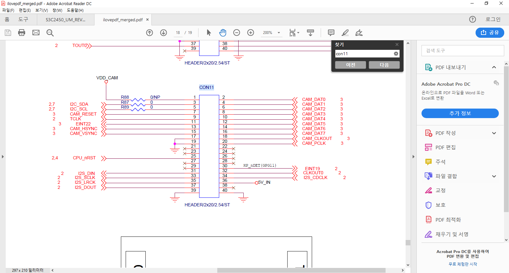
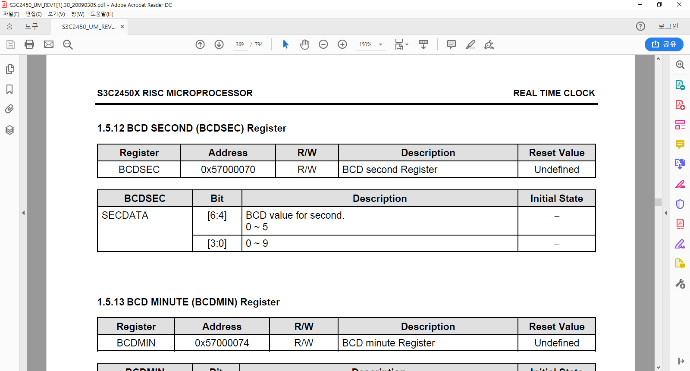
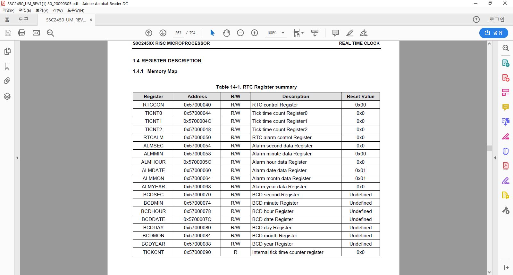

# 개발환경 셋팅
  * 임베디드 소프트웨어는 개발환경 셋팅이 30% 변수가 많다 - 보드, 케이블, vmware 등등의 소프트웨어.. usb장치들(컴퓨터의 특성을 많이 타는 디바이스)

  #
  ## 리눅스 호스트(개발환경) 설정
 
  * sudo subl /etc/udev/rules.d/70-persistent-net.rules
    ```
    # This file was automatically generated by the /lib/udev/write_net_rules
    # program, run by the persistent-net-generator.rules rules file.
    #
    # You can modify it, as long as you keep each rule on a single
    # line, and change only the value of the NAME= key.
    # USB device 0x:0x (asix)
    SUBSYSTEM=="net", ACTION=="add", DRIVERS=="?*", ATTR{address}=="00:0e:c6:8f:9c:92", ATTR{dev_id}=="0x0", ATTR{type}=="1", KERNEL=="eth*", NAME="eth1"
    ```
  * 가상머신(리눅스 머신)에서 할일들
  * 윈도우즈에서 COM1, COM2... 리눅스에서는 ttys1, ttys2
  * 확인 명령어
    ```
    tail /var/log/kern.log
    ```
  * 확인결과
    ```
    user@linux:~$ tail /var/log/kern.log
    Jun  9 18:51:29 linux kernel: [  625.029179] asix 1-1:1.0 eth1: link up, 100Mbps, full-duplex, lpa 0x41E1
    Jun  9 18:51:34 linux kernel: [  629.596213] asix 1-1:1.0 eth1: link up, 100Mbps, full-duplex, lpa 0x41E1
    Jun  9 18:51:40 linux kernel: [  635.447277] asix 1-1:1.0 eth1: link up, 100Mbps, full-duplex, lpa 0x41E1
    Jun  9 18:51:44 linux kernel: [  639.949461] asix 1-1:1.0 eth1: link up, 100Mbps, full-duplex, lpa 0x41E1
    Jun  9 18:51:55 linux kernel: [  651.166051] asix 1-1:1.0 eth1: link up, 100Mbps, full-duplex, lpa 0x41E1
    Jun  9 18:57:40 linux kernel: [  995.890658] asix 1-1:1.0 eth1: link up, 100Mbps, full-duplex, lpa 0x41E1
    Jun  9 19:02:31 linux kernel: [ 1287.134139] asix 1-1:1.0 eth1: link up, 100Mbps, full-duplex, lpa 0x41E1
    Jun  9 19:15:45 linux kernel: [ 2080.535876] usb 3-2.1: USB disconnect, device number 5
    Jun  9 19:51:43 linux kernel: [ 4238.332882] asix 1-1:1.0 eth1: link up, 100Mbps, full-duplex, lpa 0x41E1
    Jun  9 19:51:45 linux kernel: [ 4240.679531] asix 1-1:1.0 eth1: link up, 100Mbps, full-duplex, lpa 0x41E1
    user@linux:~$ 

    ```

  * 리눅스에서의 복붙 : shift 더 붙이기
  * tftp 설정파일 확인 명령어 : 
    ```
    cat /etc/xinetd.d/tftp
    ```
  * 확인결과
    ```
    user@linux:~$ cat /etc/xinetd.d/tftp
    service tftp
    {
    protocol        = udp
    port            = 69
    socket_type     = dgram
    wait            = yes
    user            = nobody
    server          = /usr/sbin/in.tftpd
    server_args     = -s /tftpboot
    disable         = no
    }
    ```
  * ip설정
    ```
    cat /etc/network/interfaces
    ```
    ```
    NAT : 가상 라우터 ip 부족 문제를 해결할 수 있다.
    -sudo ifdown eth0 && sudo ifup eth0
    ```


  #
  ## MDS2450 보드 명령어
  * MDS2450 보드에서 할일 - 부트 커맨드 설정
    ```
    setenv 
    bootdelay 1;
    setenv bootcmd 'tftp 30000000 MDS2450.bin;go 30000000';
    set serverip 192.168.0.2;
    set ipaddr 192.168.0.3;
    saveenv

    ```
  * 명령어 종류
        * printenv
        * setenv

    
  * 타겟환경에서 할일들
    * 크로스 컴파일
    ```
    1. get : 보드로 파일을 가져오는것 -> 서버IP를 통해 가져오는것
    2. put : 
    3. 파일을 가져와서 메모리에 저장, 메모리의 주소 0x30000000 로 이동(16진수 수를 의미 함)
    4. go 명령어 : 파일의 실행, 펌웨어면 펌웨어가 동작하고, 리눅스 커널이라면 커널이 부팅됨.
    ```


  * 1일차 오전 수업내용 정리 정리
    1. 가상 리눅스 복잡하고 혼란스러우니까 네이티브 써라
    2. 일단 핫플러그드 디바이스는 사용하기전에 체크됨 확인
    3. 서비스의 작동을 위해서는 환경파일 -> ls /etc 명령어로 확인
        ex)  cat /etc/network/interfaces - 네트워크 디바이스,  cat /etc/xinetd.d/tftp -tftp 디바이스

 * 서브라임
  1. subl에서 tools -> bulid system -> new bulid system 
   ```shell
   {
	 "shell_cmd": "make clean && make"
   }

   ```
  
 # LED 장치 연습

  ```c
    void Led_Port_Init(void)
    {	
      /* 
      * LED On : Active Low 
      * Initialize GPGDAT[7:4] : high
      * Setup GPGCON[15:8] : 01-> GPG7~4 Output mode
      * GPGUP pull up function disable
      * 
      */
      /* YOUR CODE HERE */  
      *GPGCON = (*GPGCON &~ (0xf<<8))|(0x5<<8);
      *GPGDAT = (*GPGDAT &~ 0x3<<4);
    }

    void Led_Display(int data)
    {
      /* 
      * LED On : Active high 
        * LED Off: Active low
      * GPGDAT[7:4]
      */
      /* YOUR CODE HERE */  
      data = data&15;
      rGPGDAT = (rGPGDAT &~ (0xf<<4))|(data<<4);
    }

    /*
    #define rGPGCON    (*(volatile unsigned *)0x56000060)	//Port G control
    #define rGPGDAT    (*(volatile unsigned *)0x56000064)	//Port G data

    */
  ```
  * 2진수 to 16진수 변환표 암기(프로그래머에게 숨쉬는것과 같은 빈도 !!! 중요하다)


  * alias  설정
    ```s
    gedit .bashrc
    #show more ls aliases
    #alias ||="ls
    ```
    * 혹은
    ```s    
    alias pbcopy='xclip -selection clipboard'
    alias pbpaste='xclip -selection clipboard -o'
    alias m='minicom -w -D/dev/ttyS1'
    alias h='history'
    ```
 # 이번주 학습 목표
  * 이번주 학습 목표
    1. LCD
    2. 오디오 
    3. I/O (주변장치, 페리페럴)
  * 다음주  ARM 프로세서

 # RTOS서적에서 정리할 내용
   1. bashrc - 34p
   2. gedit/vim - 46p
   3. boot mode - 132p
   4. rs-232 - 200p
   5. U-boot - 161p

 # H/W에서 S/W로 이어지는 과정에 대한 학습
  1. 회로도 검색
  2. 회로도볼때는 adobe pdf뷰어를 사용
  3. Edit -> Preference 클릭하여 환경설정( 단축키 : ctrl+k )
  4. General 탭 -> 첫번째 항목인 Use single-key accelerators to access tools 항목 체크
  5. 위 4번의 설정은 H, v키를 통해 Mouse Mode 변경하여 업무 생산성 향상에 도움이 됨

 # 레지스터를 매핑하는 관용적 표현 
 ```c
  //레지스터 매핑 코드
  #define r_sample (*(volatile unsigned int*)0x56000064)
 
  //코드에서의 사용
  r_sample |= r_sample(0xf<<8)
 ```
 * 코드분석
   1. #define 사용 이유 : 전처리기를 활용하여, 컴파일타임 처리 (속도 향상)
   2. volatile 키워드 : 캐쉬가 아닌 레지스터(메모리)에 직접 접근하여 값을 새로 가져오는것을 명시하는 키워드 -> 컴파일러의 최적화에 의해 발생할 수 있는 논리적 에러를 사전에 방지하는 기능
   3. unsigned int 키워드 : 32Bit MCU(혹은 MPU)의 레지스터는 32비트 연산이 최적의 정보단위 이므로 (8bit MCU의 경우는 unsigned char 형 사용 추천, ex-Atmega128, 8051..)
   4. *(X*) 이유 ★★ -> ((*(volatile unsigned int *)0x56000064))->> 0x~의 값이 주소를 나타내는 상수이며(레지스터의 주소), 주소가 바라보는곳이 레지스터의 위치임. 레지스터 연산 시 주소가 담고 있는 값을 직접 접근하기 위해서 *기호(아스테리스크) 사용 함
   * 만족스럽지 못한 설명임 추후 수정예정 -> 19.06.10
 * 리눅스를 잘하기 위해 필수불가결한 요소(꼭 배워야 함!) : 쉘 프로그래밍
   1. 예시
    ```S
     make clean && make
     make clean; make
    ```
    * 위 두가지 항목은 다르다! 정상상태의 경우 결과물은 같다!
    * make clean && make : make clean이 성공해야만 make명령을 시도한다.
    * make clean; make : make clean의 성공여부와 상관 없이 make 명령을 시도한다.
   2. 쉘의 문법이 가져오는 생산성의 향상 예시
      - if 당신이 폴더 100개를 생성해야할때
      - 쉘 문법을 모른다면 노가다
      - 쉘을 사용하는 경우
      ```s
        mkdir A{1...100}
      ```
   3. 쉘이 어려운 이유
     - 스크립트이다. 쉘스크립트.. 고로 컴파일이 없으므로 런타임시에 에러를 확인할 수 있다.
     -동일한 스크립트 타입의 언어인 자바스크립트, 타입스크립트, 파이썬의 경우 어려운 이유는 동적실행 시 에러처리 뿐 아니라, 많은 패키지들을 가져다 쓰기에 어렵다.
     - 동일하게 쉘 스크립트 또한 약 1100개 이상의 리눅스 명령어를 모두 외우고 활용하는것은 많은 시간이 소요된다.   

   4. 결론 : 쉘을 배우자, (시작하는 순간 판도라의 상자가 열린것이다)

 * 짤막상식
   1. Refreash가 필요한 기기기는? EERPOM/SDRAM/NAND FLASH/SRAM
   2. Data Processing 명령에서 Opprand2가 immediate 상수로 사용 가능한 상수는?
   3. 메모리 맵 방식에 대한 설명으로 틀린 것은?? 
      - 메모리의 일부를 입출력장치에 할당
      - 메모리 관련 명령인 로드와 스토어 기능을 통해 장치에 엑세스 한다
      - 입출력 장치에 할당 된 주소영역은 캐셔블 하게 설정된다.
      - 입출력 자이에 사용되는 변수는 volatile키워드를 달아 선언한다.


   * 당신이 임베디드 프로그래밍(뿐만 아니라 리눅스 고수가 되기 위해)에 전문성을 가지기 위해서 필요한것 : 16진수 10진수 2진수 변환 표 암기!!
      1. 인간은 직관적임을 추구하는 동물이기에 암기가 필요하다.
      2. 필요성에 대한 근거로 리눅스 커널 소스코드 공부 추천
      3. 구구단의 필요성, 공기중 산소와 물의 필요성만큼이나 중요한 사항임
   |<---->|뭐야 표가 안써지자너  

깃허브 업로드 안됨 테스트 


# 2일차 
  ## 1. 학습내용 및 목표
  1. ARM 프로세서의 내부구조 간단히
     * 클럭 중 - AMBA버스 : pclk :66MHz
  2. UART 페리페럴의 클럭에 관하여 : PCLK 클럭 활용함 
  3. 레지스터 설정   
     1. 레지스터 설정 - UART 포트 설정 : GPHCON
     2. 레지스터 설정 - FIFO 기능 : UFCON1 -> 사용하지 않음
     3. 레지스터 설정 - 보레이트 설정 : UBRDIV1 
  4. 통신이야기 (From공대)
     1. UART의 필요성
     2. RS-232와  UART의 관계
     3. RS-232,422,485 차이점 
     4. UART와  USART : 동기통신과 비동기통신
     5. 다른 종류의 통신들(SPI, I2C, UART, USART, USB)
     6. OS별 개행문자 차이
     7. ASCII와 바이너리에 대하여
     8. 통신속도(Bps, baud rate)
     9. 동기통신과 비동기 통신의 차이에 관하여


  ## 2. 구현 해야 할 코드의 헤더 정의(표준 API)
  * BSP(보드를 쉽게 사용할 수 있는 코드 정의를 위해)제공을위해 만들어야 할 몇가지 함수가 정의되어있다.
  * 상황에따라 필요없는 함수는 생략해도 된다.
  * 또한 C표준 함수를 호출할수 있는 경우 atio()와 strlen() 은 구현하지 않아도 된다.
  ```h
  // Uart.h 파일에 들어갈 내용 내용
  void Uart_Init(int baud);
  void Uart_Printf(const char *fmt,...);
  void Uart_Send_String(char *pt);
  void Uart_Send_Byte(int data);
  void Uart_TxEmpty(int ch);
  char Uart_GetCh(void);
  char Uart_Get_Pressed(void);
  char Uart_GetKey(void);
  int Uart_GetString(char *string, int leng);
  int Uart_GetIntNum(void);
  int atoi(char *str);
  int strlen(const char *str);
  ```
  * 임베디드에서 구연해야 할 C 표준함수
  ```c
  // 임베디드에서 구연해야 할 C 표준함수
  int atoi(char *str);
  int strlen(const char *str);
  // A simple atoi() function
  int atoi(char *str)
  {
      int res = 0;  // Initialize result
      int sign = 1;  // Initialize sign as positive
      int i = 0;  // Initialize index of first digit
      
      // If number is negative, then update sign
      if (str[0] == '-')
      {
          sign = -1;  
          i++;  // Also update index of first digit
      }
      
      // Iterate through all digits and update the result
      for (; str[i] != '\0'; ++i)
          res = res*10 + str[i] - '0';
    
      // Return result with sign
      return sign*res;
  }

  int strlen(const char *str)
  {
          const char *s;

          for (s = str; *s; ++s)
                  ;
          return (s - str);
  }
  ```

### 3. Uart_Init 함수의 구현
  * Uart 초기화 하는 코드는 아래처럼 구현 후 함수로 묶어 줄 수 있다.
  ```c
  void Uart_Init(int baud)
  {
      #define GPHCON (*(unsigned int *))0x56000070
    int pclk;
    pclk = PCLK;

    // PORT GPIO initial( rGPHCON )
    //GPHCON
    rGPHCON = rGPHCON &~ (0xF<<4)|(0xA<<4);

    /* YOUR CODE HERE */  
    rUFCON1 = 0x0;
    rUMCON1 = 0x0;

    /* Line Control(Normal mode, No parity, One stop bit, 8bit Word length */
    rULCON1 = 0x3;

    /* Transmit & Receive Mode is polling mode  */
    rUCON1  = (1<<2)|(1);

    /* Baud rate 설정  */		
    rUBRDIV1= ((unsigned int)(PCLK/16./baud+0.5)-1 );
  }
  ```
  * 위의 코드에서 GPHCON  
   
  
  ```c
  rGPHCON = rGPHCON &~ (0xF<<4)|(0xA<<4);
  ```


  * 여기서 삼성프로세서 (S3c2450)만의 독특한 코드가 나와서 따로 다시 적어봤다.
  * rUBRDIV1 라는 레지스터를 사용해서 Bps(baud rate)를 설정한다.
  ```c
  rUBRDIV1 = ((unsigned int)(PCLK/16./baud+0.5)-1 );
  //ex) baudrate = 115200 이라면 그대로 적으면 된다.
  ```
  

  ## 4. Init이 아닌 다른 UART 함수의 구현체 
  ```c

  void Uart_Printf(const char *fmt,...)
  {
      va_list ap;
      char string[256];

      va_start(ap,fmt);
      vsprintf(string,fmt,ap);
      Uart_Send_String(string);
      va_end(ap);
  }

  void Uart_Send_String(char *pt)
  {
      while((*pt)!='\0')
      {
          Uart_Send_Byte(*pt);
          pt++;
      }
  }

  void Uart_Send_Byte(int data)
  {
      if(data=='\n')
      {
          while(!(rUTRSTAT1 & 0x2));
          WrUTXH1('\r');
      }

      while(!(rUTRSTAT1 & 0x2));	
      WrUTXH1(data);
      //#define WrUTXH1(ch) (*(volatile unsigned char *)0x50004023)=(unsigned char)(ch)
  }

  char Uart_GetChar(void)
  {
      /* UTRSTAT1의 값을 확인하여 문자열 입력   */	
      /* YOUR CODE HERE */  
      while(!(rUTRSTAT1 & 0x1));
          return RdURXH1();
      //#define RdURXH1()   (*(volatile unsigned char *)0x50004027)
  }
  ```
  * miniterm 종료시 : 모든 리눅스 프로그램 종료는 Q -> ctrl+d -> ctrl+q or z
 
  * 레지스터란 인간이 SW적으로 하드웨어를 제어하기 위해 존재하는 것
 
  ## 5. 통신이야기 (From공대)
  1. UART의 필요성
      * 키보드와 모니터 없이 하드웨어(MCU/MPU)와 데이터를 주고받을수 있는 사실상의 표준 입출력 시스템
  2. RS-232와  UART의 관계
      * 차이는 통신 전압의 차이(통신레벨)
      * UART는 MCU에서 직접 드라이브 되는 로직레벨(5V혹은 3.3V)의 직렬통신 신호
      * RS-232는 장거리 전송을 위해 12V로 전압 레벨이 올라간 직렬통신 신호
      * UART -> RS232, RS232 -> UART 를 위해서는 Transiver 필요함 
      * Transiver는 역할 기준의 명칭이며, 해당 기능을 제공하는 반도체 소자(IC, 제품명으로는 MAX-232)가 필요하다. 혹 422이나 485 통신을 원한다면 해당 기능에 맞는 Transiver(반도체 소자)가 필요하다.
   1. RS-232,422,485 차이점 
      * 직렬통신의 3가지 종류 :  RS-232, 422, 485 각각의 특징
      * RS-232 : 일반적(저렴하다), 근거리 통신규약
      * RS-422 : 차동방식 원거리 고속 통신
      * RS-485 : Multi-drop(1:N통신) 구성 지원 half-duflex
   2. UART와  USART 그리고 동기통신과 비동기통신
      *  UART : Ansync 직렬통신
      *  USART : sync 직렬통신 -> 거의 사용되지 않음.
      *  동기통신 : Data + Clock , 클럭이 별도로 존재하는 통신(I2C) : 수신측과 송신측이 전선만 연결해도 통신이 됨(단 I2C통신은 오픈드레인 구조의 경우 풀업저항이 필요)
      *  비동기 통신 : Tx + Rx , 클럭이 별도로 존재하지 않는 통신(UART) : 수신측과 송신측 모두 상대방의 통신속도를 미리 알고 있다는 전제 하에 데이터를 주고받음.
         *  동기라는 의미는 클럭이 동기화되어있다. 비동기는 클럭라인이 비동기(연결되지 않았다) 라는 의미입니다.
   3. 다른 종류의 통신들(SPI, I2C, UART, USART, USB)
      * UART와 USART : 
      * SPI고속 단거리 통신으로 사용 주로 LCD등의 대량의 데이터를 처리하거나 영상정보를 송수신 하는 용도로 사용
      * I2C저속으로 데이터를 주고 받을 때 사용하며, 해당통신기능을 활용한 아두이노 모듈이 최근 많이 출시되고 있음 
      * PC 혹은 USB 호스트와의 연결을 위해 필요함. USB스텍이 무겁기 때문에(펌웨어의 크기가 커지기에) 낮은성능의 MCU에는 없는 경우도 많다.
   4. OS별 개행문자 차이
      * OS별 개행문자 차이 ->> 윈도우즈: "\r\n" , Unix계열(mac, Linux): "\r"
   5. ASCII와 바이너리에 대하여
      * binary의 경우 0x41 는 0x41
      * ASCII 의 경우에는 0x41은 문자 'A'  
   6. 통신속도(Bps, baud rate)
      * UART를 이용한 시리얼 통신 사실상의 표준은 : 115200 n 8 1
      * 115200 : baud rate
      * n : 흐름제어
      * 8 : 데이터 
      * 1 : 정지비트
   
#
##  Timer

  ```c

  void Timer_Init(void)
  {
    /* 
    * 	Timer0 Init 
    * Prescaler value : 255, dead zone length = 0
    * Divider value : 1/16, no DMA mode
    * New frequency : (PCLK/(Prescaler value+1))*Divider value = (66Mhz/(256))*(1/16)
    *				= 16.113Khz(16113Hz)
    */
    // target freq : 16.113khz ->> 	rTCFG0=255, rTCFG1=16
  /* TODO : Timer Clock Configure */
    rTCFG0 |= 0xff; //Bit set
    rTCFG1 |= 0xf;
    rTCFG1 &= ~(0xf<<2); 
    
    /* TCON설정 :Dead zone disable,  auto reload on, output inverter off
    *  manual update no operation, timer0 stop, TCNTB0=0, TCMPB0 =0
    */
    rTCON  = (0<<4)|(1<<3)|(0<<2)|(0<<1)|(0);
    rTCNTB0 = 0;
    rTCMPB0 = 0;
  
  }

  void Timer_Delay(int msec)
  {
    /*
    * 1) TCNTB0설정 : 넘겨받는 data의 단위는 msec이다.
    *                  따라서 msec가 그대로 TCNTB0값으로 설정될 수는 없다.
    * 2) manual update후에  timer0를 start시킨다. 
    * 	 note : The bit has to be cleared at next writing.
    * 3) TCNTO0값이 0이 될때까지 기다린다. 	
    */
  /* TODO : Timer Counter Setting */
    rTCNTB0 = 16.113 * msec;

    rTCON |= (1<<1)|(0);//manul updata
    rTCON &= ~(1<<1);//manul updata
    
    rTCON |= 1;	//trigger timer start
    
    while(rTCNTO0 != 0);// TCNTO0 : wait for Observation Registor -> read only
    
  }

  ```
  
#
#
# Day3 (수요일)

> 학습목표
>> * 타이머
>> 


 #
 ## 1. 타이머
  - 원하는 시간을 얻기위해 타이머의 두가지 요소를 변경할 수 있다. (TCNT/16비트 카운트)
    - 각각 모두 제약사향이 있다
      1. TCNT : 입력클럭(66Mhz) 에서 분주하여 만들어 낼 수 있는 클럭값만 가질 수 있다.
      1. 카운터 최소 1부터~ 최대 65535(16비트 기준)사이의 값만 가질 수 있다.
    - 위 두가지를  적잘히 조합해서 원하는 정확한 타이머를 만들어 낼 수 있다.
    - 이해가 안된다면 그리면서 이해하려고 하자. 공부에는 왕도가 없다

  - 카운터 동작 중에도 레지스터 값 변경 가능
  - 
  - 더블버퍼링 : 타이머 시작 후 값을 변경해도 된다
  - 
  - 
  - 타이머 활용중 기능 : 도레미파솔라시도 음계 만들기 (Timer 기능 사용) ->> 자주 실수하는 부분 : GPIO 셋팅을 Alternative 셋팅으로 변경
  - 타이머 소스 정리 (헤더파일과 소스파일)
  ```c
  //Timer.h
  ```
  ```c
  //Timer.c
  ```
 #
 ## 2. RTC 기능
  - 타이머와 비슷하지만 다른 목적의 페리임
      - RTC : 인간에게 친숙한, 낮은 해상도 (1초단위 클럭 사용) like as  시계
      - Timer : 고해상도 시간의 측정과 사용, PWM 등등 like as 스탑워치
  - 직관적인 사용을 위해서 BCD코드 사용 : 2진수 세계의 MCU가 직접 해당부분만 특별하게 10진법 기준 저장함.  
  - RTC의 3가지 주요 기능
      - 시계
      - 달력
      - 알람을 활용한 저전력 모드 구현★★★★★ -> 활용에서 가장 중요한 부분
  - 
  - 
  ```
  인터럽트 설명 
  TICINT
  ALMINT
  ```
  - RTC 관련 소스 정리
  ```C
  //RTC.h
  
  ```
  ```C
  //RTC.c

  ```
   - 
  - 
 #
 ## 4. WDT(와치독 타이머)
  - 와치독 타이머의 사용은 일반 타이머와 90프로 이상 비슷함.
  - 와치독 타이머는 시간을 기준으로 MCU의 오동작을 체크하여 이상상태 빠졌을 시 프로세서를 리셋하는 
 
 #
 ## 5. 메모리 및 그외 Peri 컨트롤러들 
  - 부트로더 : OS나 펌웨어 업그레이드 모드나 커널이미지 호출 시 사용하는 소형 펌웨어
  - 부트코드 : 스타트업 코드의 다른말로써 전원 인가 후 main 호출 전까지 필요한 사전작업들을 미리 수행 해 주는 코드
  - MMU 란? : 가상메모리 관리를 해주는 하드웨어 장치
  - 메모리 시스템 : 메모리(대표적으로 NAND, DRAM 에 대한 컨트롤 기능 수행)
  - 기억장치의 종류
    - 플래쉬
      - NAND 플래쉬 - 저가, SW가 저장, 코드의 실행 불가능
      - NOR 플래쉬 - 고가, 인텔, SW+Data저장
      - 차이점 링크 [나무위키 플래시메모리](https://namu.wiki/w/%ED%94%8C%EB%9E%98%EC%8B%9C%20%EB%A9%94%EB%AA%A8%EB%A6%AC)
      ```
      //위 링크로부터
      드 모르간 법칙 때문에 NAND 게이트나 NOR 게이트만으로도 모든 논리 게이트(logic gate)를 구현할 수 있다. 회로상으로 NAND 타입은 어드레스 라인이 블록 단위로 설치돼 있고 NOR 타입은 셀 단위로 설치돼 있다. NAND 타입이 블록 액세스만 가능한 이유가 이것 때문이다. 대신 배선 수를 NOR 타입보다 획기적으로 줄일 수 있어서 고밀도화가 가능해진다.

      쉽게 말해서 NAND는 서류 더미를 아무렇게나 높이 쌓아둔 것이고, NOR는 서류를 색인을 붙여 제대로 분류해 둔 거라 볼 수 있다. 서류 더미를 쌓아두면 쌓아둘 때는 빠르지만(쓰기 속도 빠름) 다시 꺼내고자 찾을 때는 느리기 때문(읽기 속도 느림). NOR는 그 반대.

      NAND의 읽기 동작이 NOR보다 느린 이유는 읽기 동작을 위해서는 어드레스 라인 한 개를 활성화한 상태에서 각 셀을 직렬로 액세스해야 하기 때문이다. 쓰기가 NOR보다 빠른 이유는 어드레스 라인 한 개만 활성화해도 블럭 전체의 셀이 선택되기 때문이다. 플래시 메모리는 셀 선택 라인이 셀 쓰기 라인을 겸하는 구조인데 NAND 타입은 이 셀 선택 라인이 여러 비트, NOR 타입은 1비트이다. NOR 타입은 읽을 때나 쓸 때나 1비트씩이지만, NAND 타입은 예를 들어 블록당 셀 수가 4인 메모리라고 하면 읽을 때는 0111 1011 1101 1110 순으로 셀을 순차적으로 선택하면서 읽어야 해서 느리다. (A and 1) or (B and 0) or (C and 0) or (D and 0) = A 라는 원리로 셀에 저장된 값을 읽는다. 그래서 NAND 타입이라 부르는 것이다. 쓸 때는 그냥 쓰려는 비트열, 예를 들어 1010 을 보내서 병렬로 쓴다.

      외계인 고문으로 유명한 인텔이 NOR 플래시 메모리의 최강자이며, NAND 타입은 D램과 마찬가지로 삼성전자, 하이닉스, 도시바 등등에서 생산하고 있다. 현재 99.9%의 USB 메모리는 NAND 타입이다. 요즘에는 굳이 NOR 타입의 플래시 메모리를 쓰지 않고 그냥 내장 부트로더가 NAND 타입 메모리에서 부트 블록을 읽어서 RAM에 복사해 놓고 실행하기 때문에 NOR 타입 플래시의 입지가 더욱 줄어들었다.
      ``` 
      - 결론1 - NAND플래쉬에서는 코드의 직접 실행이 불가능하고, NOR에서는 코드의 직접 실행이 가능하다.
      - 결론2 - 최근 추세는 NOR플래쉬 보다 NAND플래쉬 + DRAM의 조합을 많이 사용한다.
 #
 ## 6. 인터럽트 컨트롤러
 
#
# 4일차

```c

void DMA0_UART_Init(void)
{
	/* Init DMASKTRIG on DMA0*/
	rDMASKTRIG1 = 0x0;
	
	/* TODO : Select Base Address of Source and Destination*/
	rDISRC1 = &rURXH1; //rURXH1 register's address
	//KDH :  target destination address
	rDIDST1 = dst;
	
	/* TODO : Init Source & Destination Control Register on DMA1 
	 * (memory -> AHB bus, INC mode, CHK_INT -> after auto-reload )
   	 */
	rDISRCC1 = (1 << 1) | (1 << 0); // APB, FIXED
	rDIDSTC1 = (0 << 2) | (0 << 1) | (0 << 0);
	//KDH : APB BUS, Fixed address(Not increment)
	

	/* TODO : setting for H/W DMA request
	 * DCON1 : Handshake[31-1], HCLK[30-1], INT mode[29-1], Single Unit[28-0], Whole service[27-1], 
	 * Uart1[26:24], H/W trigger[23-1], Auto Reload ON[22-0], Byte size[21:20](Note: Word size<->Byte size)
	 */
	rDCON1 = (1 << 31) | (0 << 30) | (1 << 29) | (0 << 28) | (0 << 27) | (1 << 24) | (0 << 23) \
	| (0 << 22) | (0 << 20) | (8 << 0);


//KDH: point!! peri must be set -> 
	rDMAREQSEL1 = (rDMAREQSEL1 &~ (0x1f<<1))|(22<<1); // hardware trigger 
	rDMAREQSEL1 |= 1;

	 /* TODO : Turn on Trigger*/
	rDMASKTRIG1 |= (1 << 1); // DMA CHANNEL 'ON'	
}
```


```c
void Touch_ISR()
{
	/* TO DO: Pendng Clear on Touch */	
	rSUBSRCPND = (0x1<<9);//Touch Interrupt -> PIC3
	rSRCPND1 = (0x1<<31);//ADC interrupt 
	rINTPND1 = (0x1<<31);
	
	// Touch UP
	if(rADCTSC&0x100)
	{
		rADCTSC&=0xff;
		Touch_pressed = 0;
	}
	// Touch Down
	else 
	{
		rADCTSC=(0<<8)|(1<<7)|(1<<6)|(0<<5)|(1<<4)|(1<<3)|(1<<2)|(0);
		// SADC_ylus Down,Don't care,Don't care,Don't care,Don't care,XP pullup Dis,Auto,No operation
		
		rADCCON|=0x1;
		while(rADCCON & 0x1);
		while(!(0x8000&rADCCON)); // AD convert wait until end


		ADC_x=(int)(0x3ff&rADCDAT0);
		ADC_y=(int)(0x3ff&rADCDAT1);
		//양자화 계수 

		// Touch calibration complete
		if(Touch_config)
		{
			Touch_y=(ADC_y-Cal_y1)*(LCD_YSIZE-10)/(Cal_y2-Cal_y1)+5;
			Touch_x=(ADC_x-Cal_x2)*(LCD_XSIZE-10)/(Cal_x1-Cal_x2)+5;
			Touch_x=LCD_XSIZE-Touch_x;
			if(Touch_x<0) Touch_x=0;
			if(Touch_x>=LCD_XSIZE) Touch_x=LCD_XSIZE-1;
			if(Touch_y<0) Touch_y=0;
			if(Touch_y>=LCD_YSIZE) Touch_y=LCD_YSIZE-1;
		}
		// before calibration		
		else
		{
			Touch_x = ADC_x;
			Touch_y = ADC_y;
		}

		rADCTSC=(1<<8)|(1<<7)|(1<<6)|(0<<5)|(1<<4)|(0<<3)|(0<<2)|(3);
		// SADC_ylus Up,Don't care,Don't care,Don't care,Don't care,XP pullup En,Normal,Waiting mode
		Touch_pressed = 1; 
	}

	rINTSUBMSK &= ~(0x1<<9);
	rINTMSK1 &= ~(0x1<<31);
}
// Lower Layer Functions
```

```c

#define BLACK	0x0000
#define WHITE		0xfffe
#define BLUE		0x003e
#define GREEN	0x07c0
#define RED		0xf800
#define YELLOW	0xffc0

// ISR Functions declaration

#define LCD_XSIZE 		(480)	
#define LCD_YSIZE 		(272)

// Functions Declaration

void HW_Initial(void);
void Show_Welcome(char * msg);

// Global Variables Declaration

// ÅÍÄ¡Æе尡 ´­¸²À» ¾Ë¼ö ÀÖ´Â °ª
volatile int Touch_pressed = 0;
// ADC °ª
volatile int ADC_x=0, ADC_y=0;

// Calibration Á¤º¸ ÀúÀå °ª
volatile int Cal_x1=848;
volatile int Cal_y1=656;
volatile int Cal_x2=186;
volatile int Cal_y2=349; 

// ÁÂÇ¥ º¯È¯ °ª
volatile int Touch_x, Touch_y;
// Calibration ¿Ï·á °ª
volatile unsigned int Touch_config=1;

void Touch_ISR(void) __attribute__ ((interrupt ("IRQ")));

void Touch_ISR()
{
	/* TO DO: Pendng Clear on Touch */	
	rSUBSRCPND = (0x1<<9);//Touch Interrupt -> PIC3
	rSRCPND1 = (0x1<<31);//ADC interrupt 
	rINTPND1 = (0x1<<31);
	
	// Touch UP
	if(rADCTSC&0x100)
	{
		rADCTSC&=0xff;
		Touch_pressed = 0;
	}
	// Touch Down
	else 
	{
		rADCTSC=(0<<8)|(1<<7)|(1<<6)|(0<<5)|(1<<4)|(1<<3)|(1<<2)|(0);
		// SADC_ylus Down,Don't care,Don't care,Don't care,Don't care,XP pullup Dis,Auto,No operation
		
		rADCCON|=0x1;
		while(rADCCON & 0x1);
		while(!(0x8000&rADCCON)); // AD convert wait until end


		ADC_x=(int)(0x3ff&rADCDAT0);
		ADC_y=(int)(0x3ff&rADCDAT1);
		//양자화 계수 

		// Touch calibration complete
		if(Touch_config)
		{
			Touch_y=(ADC_y-Cal_y1)*(LCD_YSIZE-10)/(Cal_y2-Cal_y1)+5;
			Touch_x=(ADC_x-Cal_x2)*(LCD_XSIZE-10)/(Cal_x1-Cal_x2)+5;
			Touch_x=LCD_XSIZE-Touch_x;
			if(Touch_x<0) Touch_x=0;
			if(Touch_x>=LCD_XSIZE) Touch_x=LCD_XSIZE-1;
			if(Touch_y<0) Touch_y=0;
			if(Touch_y>=LCD_YSIZE) Touch_y=LCD_YSIZE-1;
		}
		// before calibration		
		else
		{
			Touch_x = ADC_x;
			Touch_y = ADC_y;
		}

		rADCTSC=(1<<8)|(1<<7)|(1<<6)|(0<<5)|(1<<4)|(0<<3)|(0<<2)|(3);
		// SADC_ylus Up,Don't care,Don't care,Don't care,Don't care,XP pullup En,Normal,Waiting mode
		Touch_pressed = 1; 
	}

	rINTSUBMSK &= ~(0x1<<9);
	rINTMSK1 &= ~(0x1<<31);
}
// Lower Layer Functions

void HW_Initial(void)
{
	// ÇÊ¿äÇÑ ÃʱâÈ­ ·çƾµéÀ» ±âÀÔÇÑ´Ù
	Exception_Init();
	Uart_Init(115200);	
//	Led_Init();
//	Buzzer_Init();

	Timer0_Init();
	Graphic_Init();
	
	Touch_Isr_Init(Touch_ISR);
	MMU_Init();
}

void Show_Welcome(char * msg)
{
	int a, j; 
	
	Uart_Printf("\n%s\n", msg);
	
	for(a=0;a<2;a++)
	{
		Led_Display(7);
		for(j=0; j<0x0ffff; j++);
		Led_Display(0);
		for(j=0; j<0x0ffff; j++);
	}
}

void main(void)
{
	int xtmp, ytmp;
	char* myPtr;

	Uart_Init(115200);

	HW_Initial();

/* malloc test */
	myPtr= malloc(4096);
	*myPtr= 'W';
/* printf test */
	printf("c=%c\n", *myPtr);
	free(myPtr);

	Show_Welcome("LCD & Touch Test");

	Lcd_Clr_Screen(BLACK);
	Lcd_Select_Frame_Buffer(0);
	Lcd_Get_Info_BMP(&xtmp, &ytmp, j01);
	Lcd_Draw_BMP(((LCD_XSIZE/2)-(xtmp/2)), ((LCD_YSIZE/2)-(ytmp/2)), j01); 
	Lcd_Printf(10,254, YELLOW, BLACK, 1,1,"Hello world!! !!");

	Lcd_Select_Frame_Buffer(1);
	Lcd_Clr_Screen(BLUE);
	Lcd_Get_Info_BMP(&xtmp, &ytmp, s01);
	Lcd_Draw_BMP(((LCD_XSIZE/2)-(xtmp/2)), ((LCD_YSIZE/2)-(ytmp/2)), s01);  
	Lcd_Printf(10,254, YELLOW, BLACK, 1,1,"´ÙÀ½´Ü°è·Î ³Ñ¾î°¡·Á¸é Å͹̳ο¡¼­ ¾Æ¹«Å°³ª ÀÔ·ÂÇϼ¼¿ä");

	Uart_Printf("\n´ÙÀ½´Ü°è·Î ³Ñ¾î°¡·Á¸é ¾Æ¹«Å°³ª  ´©¸£½Ã¿À!! \n");

	do
	{
		Lcd_Wait_Blank();
		Lcd_Display_Frame_Buffer(0);
		Timer0_Delay(1000);
		Lcd_Wait_Blank();
		Lcd_Display_Frame_Buffer(1);
		Timer0_Delay(1000);
	}while(!Uart_Get_Pressed());	
	
	Uart_Printf("\nÅÍÄ¡2 Calibration\n");
	
	Touch_ISR_Enable(1);   //
    	Lcd_Clr_Screen(WHITE);	     

#if 1 // Ķ¸®ºê·¹ÀÌ¼Ç »ý·« 
  
	Lcd_Hline(5,0,10-1,BLUE);
	Lcd_Vline(5,0,10-1,BLUE);
	Lcd_Printf(10,40, BLUE, WHITE, 1,1,"ÁÂÃø»ó´Ü¿¡ º¸ÀÌ´Â '+' Ç¥½Ã¸¦ ´©¸£¼¼¿ä");    
	Timer0_Delay(200);
	while(Touch_pressed == 0);
	Uart_Printf("\nADC_x:%d, ADC_y:%d", ADC_x, ADC_y); 
	Touch_pressed = 0;
	
	Cal_x1=ADC_x;  //
	Cal_y1=ADC_y;  // 좌 상단  
	
	Lcd_Hline(5,0,10-1,WHITE);
	Lcd_Vline(5,0,10-1,WHITE);
    	Lcd_Clr_Screen(WHITE);	     

	Lcd_Hline(LCD_YSIZE-5,LCD_XSIZE-0,LCD_XSIZE-10+1,BLUE);
	Lcd_Vline(LCD_XSIZE-5,LCD_YSIZE-0,LCD_YSIZE-10+1,BLUE);
	Lcd_Printf(80,200, BLUE, WHITE, 1,1,"¿ìÃøÇÏ´Ü¿¡ º¸ÀÌ´Â '+' Ç¥½Ã¸¦ ´©¸£¼¼¿ä");
	Timer0_Delay(200);
	while(Touch_pressed == 0);
	Uart_Printf("\nADC_x:%d, ADC_y:%d", ADC_x, ADC_y); 
	Touch_pressed = 0;
	
	Cal_x2=ADC_x;  //
	Cal_y2=ADC_y;  // 우 하단  
	
	Lcd_Hline(LCD_YSIZE-5,LCD_XSIZE-0,LCD_XSIZE-10+1,WHITE);
	Lcd_Vline(LCD_XSIZE-5,LCD_YSIZE-0,LCD_YSIZE-10+1,WHITE);
    	Lcd_Clr_Screen(WHITE);	     

       Touch_config=1;  //

	Lcd_Printf(0,100,BLUE,WHITE,1,1,"ÅÍÄ¡Æе带 ´­·¯º¸¼¼¿ä x,y ÁÂÇ¥Á¤º¸¸¦ Ç¥½ÃÇØ ÁÝ´Ï´Ù");   
	Lcd_Printf(0,140,BLUE,WHITE,1,1,"[Å͹̳ΠŰº¸µåÀ» ¾Æ¹«Å°³ª ´©¸£¸é Á¾·á]");  
	
	Uart_Printf("\nÅÍÄ¡ÆгÎÀ» ´©¸£¸é À§Ä¡°¡ Ç¥½ÃµË´Ï´Ù.\n");
	Uart_Printf("Å°º¸µå¸¦ ´©¸£¸é ´ÙÀ½µ¿ÀÛÀ¸·Î ³Ñ¾î°©´Ï´Ù.\n");	 	
	
	do
	{
		if(Touch_pressed == 1)
		{
			Uart_Printf("\nX:%d, Y:%d", Touch_x, Touch_y); 
			Touch_pressed = 0;
		}
	}while(!Uart_Get_Pressed());	
	
	
	/* Touch-panel Test */
	Uart_Printf("\nÅÍÄ¡ÆгΠÀÀ¿ë ½Ç½À\n");
	Uart_Printf("±×¸²À» ´­·¯º¾½Ã´Ù\n");	
#endif

	Uart_Printf("\nCal_x1=%d\n", Cal_x1);	
	Uart_Printf("\nCal_x2=%d\n", Cal_x2);	
	Uart_Printf("\nCal_y1=%d\n", Cal_y1);	
	Uart_Printf("\nCal_y2=%d\n", Cal_y2);
	
	Lcd_Clr_Screen(BLACK);    
	Lcd_Get_Info_BMP(&xtmp, &ytmp, run_er);     

	Lcd_Printf(10,40, YELLOW, BLACK, 1,1,"¾ÆÀÌÄÜÀ» ´­·¯º¸¼¼¿ä");

	for(;;)
	{
		Lcd_Draw_BMP((160-(xtmp/2)), (120-(ytmp/2)), run_er);    
	
		for(;;)
		{
			if(Touch_pressed == 1)
			{
				if((Touch_x >= (160 - (xtmp/2))) && (Touch_x <= (160 + (xtmp/2))) && (Touch_y >= (120 - (ytmp/2))) && (Touch_y <= (120 + (ytmp/2))))
				{
					Uart_Printf("\n Pressed"); 
					Lcd_Printf(80,120, BLACK, RED, 1,1," PUSH ");
					break;
				}
			}
		}
	
		Lcd_Draw_BMP((160-(xtmp/2)), (120-(ytmp/2)), run_ep);    
	
		for(;;)
		{
			if(Touch_pressed == 0)
			{
				Uart_Printf("\n Released"); 
				Lcd_Printf(80,120, BLACK, BLACK, 1,1," PULL ");
				break;
			}
		}
	}	
}
```


* 이미지 삽입 테스트
 
  - 발췌
  - 
  - 
  - 
  - 


#
# 정리가 안되서 일단 polling

#
 ## PWM 주파수제어

   - 주파수를 PWM제어 할때 code seq
     1. GPIO Alternative로 셋팅 
     2. PWM_timer1_init 함수 확인
     3. TCFG0, TCFG1 레지스터 셋팅

 ## RTC 모듈    
   - 타이머와 비슷하지만 다른 기능 RTC
     - 타이머 : 고해상도 시계, mcu클럭 단위시계 Like as 스탑 워치
     - RTC : 저해상도 초단위 시계Like as 벽걸이시계
   - RTC는 BCD코드로 구성됨을 주의
     - BCD : Binary coverted Decemal -> 2진화 10진 코드로써 3비트로 10진수를 표현한 코드 구성임. 
     - 예시 : (DEC,10진수)15 표기 시 
     ```  
     Nomal binary : 0b 1111 = 0x f
     BCD binary : 0b 1101= 0x 15
     이해하기 쉽게 콤마로 구분하면
     BCD binary : (0b 1),(0b 101)= (0x 1),(0x 5)
     ```
     * 10진수 체계로의 직관적 변화를 위해서 사용
   - 358p : RTC모듈로 입력되는 클럭은 프로그래머블 하지 않게(프리스케일러를 거치지 않고) 1Hz 가 입력됨을 확인할 수 있다 !()[]
   - 매 1초마다 TICINT, ALMINT 레지스터에 의해서 인터럽트가 발생할지 안할지의 여부가 결정된다.
   - 이떄 주의할점은 RTC 모듈은 독립적인 VDD(일반적으로 코인셀)연결이 필요하며, 외부클럭(약 32khz)인가가 필요하다, 최근 나온 칩들은 클럭까지 내부에 구성되어있어서 independent VDD 인가만으로도 RTC기능수행할수 있는 칩들이 많다.(이때 Crystal clock은 selectorble하다)
   - RTC를 사용하는 용도로는 크게 3가지이다.
     1. 시계
     2. 달력
     3. 알람
     4. 저전력 구현
     - ->> 이중에서 저전력구현 4번이 가장 중요한 기능이다.
     RTC를 이용해서 Power management 를 구현한다!!

 ## Watchdog (WDT Timer)
   - Timer와 90% 이상 유사하지만, 주로 System fault를 감지하는 용도로 사용된다.
   - 주로 사용하는 용도는 아래와 같다.
     1. NAND Flash Read Write 시에 
     2. 외부 RAM 혹은 periperial중에 RMB 기능이 갖춰진 외부 peri사용시(RMB = ready, mode, busy) 
 ## 인터럽트 컨트롤러 
   - 인터럽트는 Hardware dependency 하므로 Setting에 각별히 주의하여야 한다.
   - schematic reding 시 참고사항
     1. Low active symbol(negative action) pattern
       ```
       1.n 기호: nRESET , nRD, nWD
       2./ 기호 : /RESET, /BOOT, /rst
       ```
     2. High active symbol(positive action)
       - 대부분의 핀이 이에 해당
       - 위의 두가지 경우(n혹은/) 제외한 나머지
       ```
       IRQ, TEST, GPIOA 1, Tx, Rx
       ```
     - 결론 : 하드웨어에 대한 이해가 필요한 영역이다 : 이를 위해서는 mannual 읽어야한다.

 ## Network Chipset    
   - 네트워크 칩셋 사용시 주의사항(유선랜, OSI 7계층 중 하드웨어 부분)
     1. periparall 
     2. Primery PIC(Programmerble Intettput controller)
     3. Secondry PIC(Programmerble Intettput controller)
     4. IRQ
     5. ARM Core
   - PC(Program counter), Registor 차주 진행
   - 인터럽트 상황시 chip 내부 시퀀스는 아래와 같음
     1. 레지스터 백업
     2. check in counter
     3. 실행
     4. 레지스터 복구
   - 인터럽트 발생 시 알아야할 칩 내부 동작
     - 인터럽트 상태 레지스터 -> 인터럽트의 정보(발생위치, 우선순위)
     - 인터럽트 복구 시 상태 레지스터 클리어가 필수(안해주면 무한  인터럽트 상태에 빠짐)
     - 인터럽트 마스킹 (인터럽트 발생시 무시/허용) - 프로그래머블 하다
     - 우선순위 - ARM Core 인터럽트는 고정, Nested Vector Interrput 는 우선순위의 변경 가능
     - IRQ 와 FIQ 가 존재
       - IRQ는 일반 우선순위
       - FRQ는 긴급 우선순위
     - ARM Core에 인터럽트 핸들러 등록을 위해서는 함수 포인터 테이블을 통해 코어에게 함수의 주소를 알려줘야 함
     - 특별히 인터럽트 마스킹 레지스터에 코딩할 때에는 복합대입 연산이 아닌 대입연산으로 코딩해야 함(놓치기 쉬운 실수)
       -예시,REG가 인터럽트 마스크 레지스터일때 10번비트와 11번 비트를 0으로 클리어 하기 위한 코드
       - 옳은 예
       ```c       
        REG = (1<<11)|(1<<10);//GOOD
       ```
       - 틀린 예
       ```c       
        REG &= ~(1<<11)|(1<<10);//BAD
       ```
       - 일반적인 C Programming이라면 다르지만, 인터럽트 마스크 레지스터의 경우 하드웨어적인 특성으로 인해 위와같은 방법을 사용 해야만 한다(강제사항)
       
 ## DMA - Direct Memory access
   - DMA의 필요성에 대하여
     - 기존 CPU의 업무는 Peri(주변회로 : ADC, UART, LCD, Audio)와 메모리간의 데이터의 이동(load & store)을 관장해줬는데, 해당 업무를 CPU대신 DMA컨트롤러가 BUS신호를 통해 메모리에 직접 접근하여 데이터를 주고받는 역할
     - 다른점이 있지만, 페리페럴-Core간 공유메모리의 개념
   - DMA가 동작하는 방식(S3C) 
     1. core에서 DMA 사용 가능하도록 REG 셋팅
     2. peri에서 core에 DMA 사용 요청
     3. core 에서 DMA 사용 가능 하도록 AHB 라인 Hi-z상태로
     4. 
   - DMA초기화 시 필요한 데이터(및 시퀀스)
     1. 소스
     2. 목적지
     3. 전송크기
     4. 소스주소
     5. 목적지주소
     6. 전송단위
     7. 블록전송
     8. 반복유무
     9. 전송완료 확인
     10. 

      


