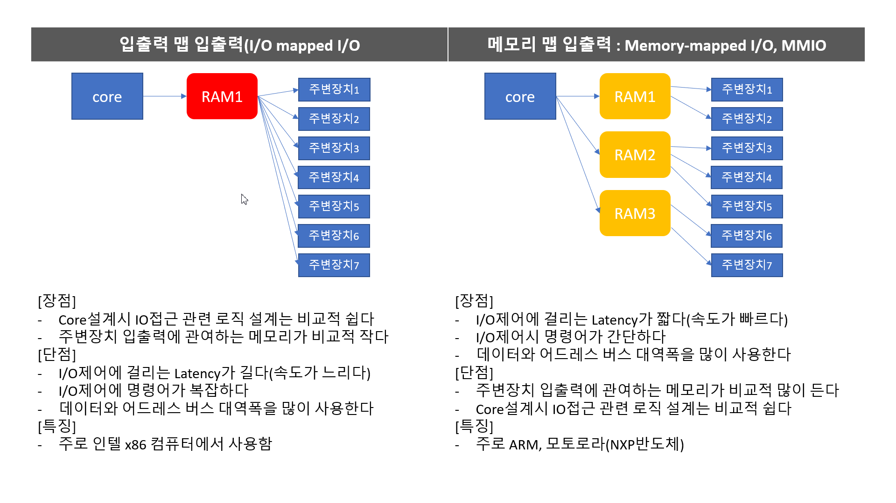

 # 5주차 
 학습목표
  1. Arm architecture에 대한 학습과 이해
  2. Armv7->11->cortex 발전과정에서 추가된 명령어 및 신기능과 core요소에 대한 학습 
     -특히 MMU, Cache(i&d), BUS에 대한 이해
  3. ARM프로세서에서 동작하는 명령어와 어셈블리어 ATCS표준에 대한 이해
  4. 내부에 존재하는 레지스터에 대한 이해(프로세서 레지스터이며, IO컨트롤용 하드웨어 레지스터가 아님)
  5. ARM프로세서와 임베디드가 잘 맞는 이유와 임베디드 프로그래밍 활용방안에 대하여
  - MDS6주차 과정 진행 중 최고의 강사님 블로그 페이지 : [가일의 임베디드 스쿨 참조](https://blog.naver.com/guile21c)
  - 느낀점 : 모든것이 막연하고 추상적인 개념이였다. 컴퓨터의 부팅에서부터 프로세서가 어떻게 동작하는것인지, rom ram이 왜 별도로 존재하는지, NAND 에서 부팅이 안되는 이유는 대관절 무었인지 궁금증 투성이였다. 막연하기만 했던 프로세서 프로그램 부팅 프로그램의 로드와 실행과정 OS booting이 어떤것인지에 대해 배운 소중한 시간이였다. 특히 쉽사리 배울수 없는 ARM Asembly에 대하여 어디에서도 배울수 없는 프로세서에 대한 깊은 이해가 너무너무 소중하고 감사한 시간이였습니다. 이번주 수업은 저에게 너무너무 즐겁고 유익한 시간이지만 역설적이게도 너무 걱정되는 이유는.. 과연 대한민국에 ARM 프로세서와 어셈블리어를 잘하는 능력이 요구되는 업무가 대한민국에 얼마나 존재할까.. 너무 잘 맞는 업무이고 잘할수 있는 자신감과 실제로 성과(다른 학우들에게 알려주기도 하고, 정리해서 요약하기)도 냈지만, 이 분야의 강점을 어떻게 살려야할까에 대한 고민이 남는 고민이 깊어지는 순간입니다. 앞으로도 영원히 포기하거나 잠들지 않는한, 하게될 고민 나의 강점, 내가 잘하는 분야인 core의 이해 - 하드웨어와 소프트웨어 모두 잘하고 전세계의 10억명에게 내가만든 제품 과 서비스를 제공하겠다는 내 인생의 Mission을 어떻게 달성해야할지에 대한 고민이 깊어지는 한주였습니다.
  긴글 읽어주셔서(혹은 앞으로라도 읽게 되시거나, 모자란 내용이나마 한번이라도 봐주셔서) 진심으로 감사드립니다 -김동훈 배상-
  


 #
  ## 이번주 학습내용 Overview
   - 이번주 학습목표 : 하드웨어 제어에 대한 개념(감잡기)확립, 프로세서에 대한 이해

     - 레지스터의 3가지 종류 
       1. 범용 레지스터
       2. 제어용 레지스터
       3. 상태 레지스터
	  - 산술&논리 연산 장치(ALU) : 산술연산과 논리연산을 수행해서 레지스터에 저장
     - 버스의 3가지 종류
       1. 데이터 버스
       2. 어드레스 버스
       3. 제어 버스
     - 파이프라인 : 프로세서 내부에서 명령어들이 처리되는과정을 좀더 빠르고 효율적으로 수행하는 기법
     - 구동 프로그램
       1. 머신랭귀지 : 기계어
       2. 니모닉 코드 : 유사 어셈블리어
       3. 어셈블리어 : 니모닉 코드 수준으로 직접 프로그래밍 할수 있게 만든 언어
     - 어셈블리어 특징(장점만 적겠슴.. 강사님께서 어셈블리어를 매우 좋아하심)
       - 기계어에 비해 상대적으로 이해하기 쉽다..(02ea13f98f 이런것보다야..)
       - 가장 기본적인 수행 단계를 이해할 수 있다
       - 고급언어보다 이해하고 사용하기 어렵다(는 편견이다) -> 오히려 C보다 문법적 요소가 적다
       - 해당 아키텍쳐의 구조 및 동작에 대한 깊은 이해가 필요하다
       - 아키텍쳐마다 다르기 때문에 배우기 어렵다(는 편견이다) -> 한번 배워두면 다른 프로세서의 어셈블리어 배우기가 매우 편해진다
    - 버스란: 신호선의 집합
       1. 어드레스 버스
       2. 제어버스
       3. 데이터 버스
    - 폰노이만 아키텍쳐 VS 하버드 아키텍쳐
       - 데이터와 명령어 버스가 분리된 경우 하버드, 아닌겅우 폰노이만
    - 저장장치의 물리적 구성
       - [RAM]
         1. SRAM : flip-flop으로 구성(NOT Gate 2개의 Shift Registor)
         2. DRAM(SDRAM, DDR 포함) : Cap으로 구성됨, Refresh 필요
       - [Storage]
       3. EEPROM
       4. Flash - NAND
       5. Flash - NOR
    - 사담으로 항상 느끼는건데 ROM,RAM,주기억장치 보조기억장치 이런 항목들은 너무 오래되고 시대에 한참 뒤떨어진 분류기준인듯 하다. 주기억장치가 주로 기억을 담당하는건지 CPU가 요청하는 정보를 주로 전달해주는지도 명확하지 않다. 따라서 필자는 여기서, 단순히  RAM과 Storage 두가지로 구분하겠다. 
     - IO자원관리는 세가지 방식이 주로 사용된다
       1. polling
       2. interrupt
       3. DMA
 
 #
  ## ARM Architecture  
   - ARM Architecture 
  

    - 리틀엔디안과 빅엔디안에 관하여
      - 리틀엔디안용 하드웨어가 별도로 존재하고 (메모리 배선에 의존적)
      - 리틀엔디안용 컴파일러 또한 별도로 존재한다.   
    - .global 키워드의 의미
      - 없으면 에러 발생 ...
      - 유사어셈블러 sudo 코드
    - b. 의미 while(1)
      - c언어에서의 무한루프
    - 다양한 명령어 지원
      1. ARM 명령어
      2. Thumb명령어 / (Thumb-2 명령어)
      3. jazell 코어
    - 다양한 인터럽트 : IRQ, FRQ
      - FRQ 는 고속 인터럽트 : Low Latency
      - ARM9이전 : PIC(프로그램 인터럽트), 이후 : VIC(벡터 인터럽트 컨트롤러) -> NVIC로 진화
    - 프로그래머가 ASM 작성시 필요한 정보들 : Programmer's model
      1. 명령어
      2. 메모리 구조
      3. 데이터 구조
      4. 프로세서의 동작 모드
      5. 프로세서 내부 레지스터 구성 및 사용법
      6. Excption 처리
      7. 인터럽트 처리
    - 대부분의 회사에서는 코딩할사람은 많다. 문제해결할 사람은 적다.
      - 문제를 해결할수 있는 해결사가 되자
    - ARM의 명령어 3가지 종류
      1. ARM명령어
      2. Thumb/Thumb2
      3. jazzle
    - 명령어 관련한 알아둘 사항들
      1. Load/Store 만으로 메모리접근
      2. Branch 명령어(c언어의 goto)
      3. 상대주소 방식
      4. asm에서의 상수는 immedeate상수 -> #문자, 해시문자 사용
      5. 32비트 고정 명령어 길이 사용 : pipeline 구성이 용이 = RISC 프로세서 특징
      6. CISC프로세서는 가변길이 명령어(Veriable operand length)
      7. 어셈블리어를배우는것은 임베디드의 개념을 탑재한 사람이 되는것
      8. 기본개념(체계, system)이 중요한 이유는 문제해결
    - 명령어 처리 절차(3단계)
      1. Fetch : 코드읽기
      2. Decode : 코드해독
      3. Execute : 코드 실행
        - 파이프라인 프로세서 : 매순간 매 클럭마다 3단계의 모든 실행기들이 오퍼레이션 동작 수행 중
        - 프로세서가 매우 고효율로 동작할 수 있다.
        - Like as 분업화

    - Java명령 : jazelle core 확장시 자바 명령어 수행 가능
    - Latency, througput, bandwidth 차이점
      - Latency : 지연시간, 외부 인터럽트 요청으로부터 실제 ISR cord실행시까지 걸리는 지연시간
      - througput : 시간당의 CPU 처리량, CPU의 관점에서 시간당 데이터 러리할 수 있는 능력에 대한 지표
      - bandwidth : 시간당의 회선의 데이터 전송량 , 회선의 관점에서 시간당 데이터를 전송 해 줄 수 있는 능력에 대한 지표

    - 빅엔디안 VS 리틀엔디안
      - 모토롤라 CPU VS 인텔 CPU
      - 애플 PC VS IBM PC
      - ARM프로세서는 후발주자로써, 리틀엔디안 빅엔디안 모두 대응할 수 있도록 제작함.
      - 단, s3c2450은 언얼라인드 엑세스 비허용함, 메모리는 반드시 4의 정수배로만 읽거나 쓸 수 있다. - Data abort 발생
      - 동작모드(Operation Mode)
        - User Mode : 유일한 비특권 모드. IO와 RAM에 접근에 제한이 있다
        - FIQ : 빠른 인터럽트 처리를 위한 모드
        - IRQ : 일반적으로 사용되는 인터럽트 처리를 위해 프로세서의 동작 모드
        - SVC : 시스템 자원을 관리할 수 있는 프로세서의 동작 모드 슈퍼바이저 모드임
        - 이밖에도 abort, undefined, System, Exception 이 있음
        - Operating 모드 별 레지스터 : 6가지 모드별 37개의 레지스터가 존재한다.
        - 참고로,  IO 맵핑레지스터와 cpu 연산에서의 레지스터가 존재한다
     - 스텍포인터(sp, R13)     
       - 스텍포인터는 프로그램에서 사용하는 스텍의 위치를 지정하는 레지스터
       - 프로세서의 동작 모드마다 별도로 할당된 SP레지스터가 존재한다
       - ARM은 별도의 스텍 명령이 없다
     - 레지스터는 두가지가 존재하는데,
       1. 프로세서 레지스터 : 프로세서 내부의 고속 연산 버퍼 레지스터
       2. 하드웨어 레지스터 : Core에 연결되여 주변 peri 에 memory mapped reg로 존재함.
         - 위키백과 레지스터 검색 추천
   ### 중간정리
   - 레지스터는 총 37개가 존재함
   - FIQ 는 private R8 레지스터가 존재함
   - 동작모드마다 lr(링크레지스터)와 Sp(스텍포인터)가 존재함
   - pc(프로그램 카운터) 는 읽기전용, 다음에 수행 할 위치를 담고 있는 레지스터
   - 어셈블러로 구현하는 인터럽트 핸들러 : 마스터 핸들러 -> 함수호출 서브 핸들러
   - 1개의 CPSR(Current Program status Registor)와 5개의 SPSR이 존재하며, SPSR은 CPSR이 복사된 형태이다.
   - PSR(CPSR)의 레지스터 비트별 정보
     - f,s,x,c 영역이 존재함
     1. f영역
        - N : 음수 비트(네거티브 플래그)
        - Z : 영 비트(제로 플래그)
        - C : 캐리 플래그
        - V : 오버플로 플래그
        - Q : 읽기전용 - 큐플래그, staturation 발생
        - J : 읽기전용 - java 바이트코드
     2. s영역
        - 예약
     3. x영역
        - 예약
     4. c영역
        - I : IRQ 인터럽트 En/Dis
        - F : FRQ 인터럽트 En/Dis
        - T : Thumb state인지 아닌지를 표시
        - Mode : 7가지 동작모드 결정
   - 위에서 CPSR 레지스터의 구성요소에 대하 알아보았습니다.
   - C영역 mode 레지스터 4비트로 7가지 모드가 존재하는데, 특권<-> 사이의 모드 전환에 대하여 공부해야함(75p)
   > 특권모드와 비특권 모드 사이의 변환에 관하여
   >> ㄴㅇㄹ
   - ARM의 Exception
     - Reset
     - Undefined Instruction
     - Software Interrupt
     - Prefetch Abort
     - Data Abort
     - IQR
     - FIQ
   - FIQ 인터럽트 Latency는 짧다
   - 프로세서의 Reset과 Start-up code
     - 프로세서에 리셋신호가 입력되면 시퀀스 : 80페이지 참조


   ## 중간점검
   1. ARM 아키텍처의 특징 4가지
   2. Programmer's model이란 무엇인가?
   3. 32비트 ARM 명령어가 가지는 특징은 무엇인가?
   4. 16비트 Thumb 명령어가 가지는 특징
   5. ARM 프로세서의 state에 대하여 설명하여라
   6. 리틀엔디안-빅엔다인의 차이점 분석
   7. ARM의 7가지 동작모드에 대하여 설명하여라
   8. 스텍보인터와 링크 레지스터로 사용되는 레지스터는?
   9. 프로그램 Status레지스터(PSR) 은 무엇인가?
   10. Exception 이란 무엇>
   11. Exception Vector 에 대하여 설명
   12. Exception 이 발생하면 누가 어떤 행동을 하는지 설명하라
   13. 인터럽트 Latency란 무었이며 FIQ의 인터럽트 Latency는 얼마인가?
   14. 하드웨어적 리셋 신호가 구동되면 ARM의 동작에 대하여 논하여라


   ## ARM9 프로세서의 주요한 특징들
   - 디버깅을 위해 필요한 두가지 인터페이스
     1. 디버거(T32, Ulink, ST Link...)
     2. 프로세서 내부에 디버깅 인터페이스 존재 : Embeded ICE-RT
   - 명령어 개선점
     - 32비트 ARM 명령어와 코드사이즈 단축을 위한 16비트 Thumb명령어 준비됨
   - ARM9 프로세서에 적용된 5단계 Pipeline
     1. 패치 코드 : 코드 읽기
     2. 디코드 : 코드해독
     3. 액시큐트 : 실행
     4. 메모리 엑세스 : 메모리접근
     5. 레지스터 쓰기
   - 파이프라인의 이상적인 동작
     - 파이프라인은 코드의 자연스러운 흐름(=분기문 없는 흐름)일때, 가장 효율이 좋다. -> 예를들어 C++의 인라인 어셈블 함수는 파이프라인의 성능을 향상시킨다.
   - 파이프라인의 성능이 하락하는 경우 두가지
     1. 인터록 사이클 : 설계된 파이프가 Fet-Dec-Ect-Acs-Wrt 순서인데, 설계된 파이프와는 다른 순서가 필요할때 인터록 삽입, 아무것도 안하고 실행흐름이 뒤로 밀림
     2. 브렌치 명령어 분기명령어 실행 시 파이프라인 수행성능 하락 함
     ->> ARM11 부터 분기예측 지원(분기예측은 멜트타운 이슈로 논란이 된 적이 있음)

 #
 ## 어셈블리어 강의
  - 어셈블리 학습의 목적 : 하드웨어 제어하는 느낌에 대하여 학습하기 위해
  - 조건필드 : Data processing 중 명령 비교를 위한 명령은 접미사 S 삽입
  - ARM에서는 절대주소지정이 존재하지 않는다. 오로지 상대주소 지정방식
  - 이에따라 PC+offset으로 다음에 이동할 코드의 주소를 파악하는데 이로인해 +-32MB이상 주소 차이가 나는 영역으로 분기가 불가능하다.
  - 위를 Restriction 제약사항 이라고 하며, 기계어 코드 수준의 제약사항임. 분기가능한 ADDR의 제한이 존재함
  - Branch With Link(BL)명령 : 파이프라인 프로세서라서 LRdms 
  - Subrutine Return : LR에 저장된 주소를 PC로 옮긴다 : mov pc,lr
  - EX-OR의 진짜의미 : 마법의연산자 ^ 용도 3가지
    1. toggle할떄 사용 ex) GPIODAT^=(1<<x);
    2. Bit clear
    3. 논리계산의 if

  - Rotate동작 : 머신랭귀지 수준에서 32비트 명령어의 한계로 인해 큰 숫자를 사용할 수 없다. 따라서 등장한 기법이 ROR과 RRX기법이 사용됨. ->> 비트 순회
  - immedate 상수란 연속된 특정 패턴의 비트가 8자리 이하일때, 비트순회를 통해 만들어 낼 수 있는 상수임. ->> RISC프로세서의 제약사항을 느낄수 있다
  - CPSR은 C언어로 접근이 불가능하다.
  - ARM에서는 메모리의 접근을 오로지 Load Store로 한다. 또한 여전히 indirect address 방식을 사용한다.

  - 부팅에 대한 이해
    - 부팅에 관해 잘 정리된 글 3가지 
      - [링크1](http://recipes.egloos.com/5317479)
      - [링크2](https://lifeseed.tistory.com/56)
      - [링크3](https://m.blog.naver.com/PostView.nhn?blogId=xogml_blog&logNo=130141602348&proxyReferer=https%3A%2F%2Fwww.google.com%2F)
    - 부팅에 대한 본질적인 이해를 요약하면 다음과 같다.
      1. 사전지식 : 프로세스 VS 프로그램 차이는 실행중인가 아닌가에 대한 차이
        - 그럼 실행중일때와 안실행중일때 차이는 뭐닝?(C언어파일 .exe 기준)
        - 프로그램일때는 바이너리 형태로 txt, bss, ro영역의 데이터들이 저장되어있다가(Nand같은 스토리지에), 실행되는 순간에 OS로부터 할당받은 메모리공간에 순차적으로 txt, bss, ro영역의 데이터들이 메모리에 올라가서 실행 됩니다. 이때 프로그램 시절에 존재하지 않던 Heap과 Stack영역이 생성되고 초기화되면서 프로세스가 동작함
      2. 프로세스 동작과 동시에 CPU자원을 초기화 함. MMU 메모리컨트롤러, LCD, GPIO 이더넷컨트롤러 등등등..
      3. 이후 메모리공간으로 NAND에 저장되어있던 OS를 불러와 부팅하면 끝.
      4. x86 시스템의 경우, mainboard에 존재하는 BIOS가 이 역할을 수행 함
  - ldmia : 스텍이 가르키는 곳에는 꼭 반드시 필수적으로 유효한 데이터가 존재함.
  - Swap의 동작 : semapore동작시 사용
  - 프로세서의 State변경 명령 : bx 명령어 사용, b명령어의 확장버전으로 b명령어(브랜치) + Exchange의 줄임, ARM명령어 수행하다가 Thumb명령어 수행 시 사용
  - ARM & Thumb 인터워킹 : 각각의 장단이 있는 두가지 명령어가 서로 번갈아가며 수행하기 위해서는 인터워킹이 필요하며 이떄 필요한 인스트럭션이 BX
    - ARM state와 Thumb state를 변경해가며 구동하는 인터워킹 시 Assembler에서는 ATPCS를 준수해야 함.
    - BX 함수주소 +1, BLX 함수명
    - saturation 연산은 uint8_t 자료형에서 255 + 1 = 255가 되는 명령어이다. 디폴드 상태에서의 동작은 255+1 = 0(CPSR레지스터에 Overflow비트 셋) 이 기본동작임. -> C언어 수준에서 의도된 오버플로우 동작에 영향을 미칠 수 있다.
    - 강사님의 Insight - Not only freeRTOS에 대한 지식
       ```
       - freeRTOS는 아마존이 인수해서 위태한거같지만 현시점에서 무료로 사용할수 있으며 많은 Board에 포팅된 좋은 OS임
       - 어셈블리어가 필요한 이유중 하나가, freeRTOS같은 OS를 처음 포팅할 때 어셈블리어를 모르면 포팅을 할수 없기에 이식할수 없고 이는 폭이 좁아지는것을 의미함
       - 강사님께서 다니시던 회사일 : 어셈블리 하실수 있는분들이 다 퇴사하셨어요!
       - 하드웨어에 대한 감각을 익히기 위해서는 상위단에서 함수호출한다고 되는게 아니다. 어셈블리 수준에서의 학습을 진행해야 알게 되는것이다.
       - 해당 과목에 관심과 흥미가 생긴다면 공부법
       - 펌웨어등을 직접 했다에 큰 의미를 두고
       - 결국 회사는 잘하는게 있어야한다. 뽑아야되고 일해야하는 이유를 만들어라 
       ``` 
  - [강사님 블로그에서 버스에 대한 이해를 탐독하자](https://blog.naver.com/guile21c/50549791)
  - 어셈블리어를 배워야하는 이유 : memcpy등의 함수로는 메모리에 대한 이해가 추상적일 수 뿐이 없다.  -> 하드웨어에 대한 정확한 이해를 위해서 배운다
  - 하드웨어 제어는 입출력장치를 어떻게 제어하는지에 대하여 배우는것임.
    - 입출력장치(주변장치, IO, 페리페럴) 제어방법은 지구상에 딱 두가지 존재한다. 인텔을 필두로 하는 CISC아키텍쳐  X86 IBM호환 PC가 사용하는 방식인 IO맵 방식, 모바일 디바이스에 힙한 ARM아키텍쳐로 대변되는 RISC프로세서의 메모리 맵 방식
    두 가지가 존재한다
    - Link : [I/O맵 방식의 위키백과](https://ko.wikipedia.org/wiki/%EC%9E%85%EC%B6%9C%EB%A0%A5_%EB%A7%B5_%EC%9E%85%EC%B6%9C%EB%A0%A5)
    - Link : [메모리 맵 방식](https://ko.wikipedia.org/wiki/%EB%A9%94%EB%AA%A8%EB%A6%AC_%EB%A7%B5_%EC%9E%85%EC%B6%9C%EB%A0%A5)
    - 위키백과가 좋긴한데 바쁜분들을 위한 한장요약
    
    - 근본적으로 X86같은 PC시스템에서 모터를 다이렉트로 돌리는건 넌센스다(빡빡이..)
    - 비슷한 맥락에서, 라즈베리파이의 x86버전인 라떼판다도 Arduino 가 보드에 장착된 형태이지 CPU에서 direct control하는 핀이 아니다. 
  - 메모리의 복사는 프리인덱스를 쓰면 안된다, 빵꾸남
  - 아무리 배워도 프로그램은 책 100권보다 코드 1줄 짜는것이 훨씬 좋고 유익하다.
  - LDM/STM의 어드레스 지정방식 : LDMIA/LDMFD/STMIA/STMDB 의 4가지 명령어를 기억하자
  - Pre-Decrement 어드레스 지정(STMDB R9)
    1. SP 초기위치 100c
    2. STMDB 코드실행
    3. SP 감소시켜
  

 
 #
 ## 환경설정
  - 강사님의 Makefile(disasm 나오는 코드)
   ```
   ##########[Embedded C test firmware Makefile]##############
   #
   # NAME : Makefile - S3C2450 test Firmware Makefile
   # Brief history
   #----------------------------------------------------------
   #
   #	2015.08.10, Seonghye : Modified
   #
   ###########################################################

   .EXPORT_ALL_VARIABLES:

   ## If you want to change path, modify here

   TOPDIR =$(PWD)
   TOOLPATH = /opt/CodeSourcery/Sourcery_G++_Lite

   SRCS	= libc.c  Main.c Uart.c exception.c
   ASRCS	= s3c2450_startup.S libs.S

   OBJS	= ${SRCS:.c=.o} ${ASRCS:.S=.o}

   CC = $(TOOLPATH)/bin/arm-none-eabi-gcc
   LD = $(TOOLPATH)/bin/arm-none-eabi-ld
   OBJCOPY	= $(TOOLPATH)/bin/arm-none-eabi-objcopy
   OBJDUMP	= $(TOOLPATH)/bin/arm-none-eabi-objdump

   LIBCDIR =$(TOOLPATH)/arm-none-eabi/lib
   LIBGCCDIR =$(TOOLPATH)/lib/gcc/arm-none-eabi/4.5.2
   LIBC =$(TOOLPATH)/arm-none-eabi/lib/libc.a
   LIBGCC = $(TOOLPATH)/lib/gcc/arm-none-eabi/4.5.2/libgcc.a

   ## User library for UART1 Driver
   MY_LIB_PATH = $(TOPDIR)/Libraries
   LIBUART =  $(MY_LIB_PATH)/libUart1.a

   #### Option Definition ####
   INCLUDE	=  -I$(TOPDIR) -I$(LIBCDIR)/include -I$(LIBGCCDIR)/include

   CFLAGS	+= $(INCLUDE) -g -Wall -Wstrict-prototypes -Wno-trigraphs -O0
   CFLAGS	+= -fno-strict-aliasing -fno-common -pipe
   CFLAGS += -march=armv4t -mtune=arm9tdmi -fno-builtin -mapcs

   LDFLAGS	= --cref -Bstatic -nostartfiles -T S3C2450-RAM.ld -Map 2450main.map
   OCFLAGS = -O binary -R .note -R .comment -S

   2450TEST = MDS2450.bin

   %.o:%.S
      $(CC) -c $(CFLAGS) -o $@ $<

   %.o:%.c
      $(CC) -c $(CFLAGS) -o $@ $<

   all: $(2450TEST)

   $(2450TEST) : $(OBJS)
      $(LD) $(LDFLAGS) -o MDS2450 $(OBJS) $(LIBC) $(LIBGCC) \
      -I$(LIBGCCDIR)/include -I$(LIBCDIR)/include -L$(LIBC) -L$(LIBGCCDIR) -lgcc

      $(OBJCOPY) $(OCFLAGS) $(TOPDIR)/MDS2450 $(TOPDIR)/$@
      $(OBJDUMP) -d $(TOPDIR)/MDS2450 > $(TOPDIR)/MDS2450.dis
      cp $(TOPDIR)/$@ /tftpboot

   clean:
      rm -f *.o 
      rm -f $(TOPDIR)/$(2450TEST)
      rm -f $(TOPDIR)/MDS2450
      rm -f $(TOPDIR)/2450main.map
      
   dep:
      $(CC) -M $(INCLUDE) $(SRCS) $(ASRCS) > .depend

   ifeq (.depend,$(wildcard .depend))
   include .depend
   endif					
   ```
  # 어셈블리 코딩에 관하여(ARM11 기준)
   ## 어셈블리어 규칙 - 레이블 작성법
     1. 알파뉴메릭(_포함)으로 작성
     2. 1번 COL 에 작성
     3. 콜론은 있을수도 없을 수도...
     4. 공백문자, 탭문자는 하지말아 ->> 컴파일러마다 다름.
     5. 어셈블리 코드에서는 레이블 꼭 필요함 
     6. 레이블만 첫번째 칼람에 작성
     7. 나머지는 탭문자 한칸 삽입 후 작성
     8. 일반적으로 탭 대신 스페이스바 추천 이유는 편집기마다 탭길이가 변경됨
	   -> 탭대신 space2로 변경, 공백문자2개 사용함.
     9. 오퍼렌드는 대소문자 섞어쓰지마 소문자 추천 레지스터도 소문자(일반적)
     10. 오피코드와 오퍼렌드 사이에는 분명하게 공백문자 삽입해야함.
     11.   bl HOW_TO_RETURN @ branch with Link
     12. mov pc,lr @ return명령어
  ## 어셈블리어 규칙 - 1
   ```c
	HOW_TO_RETURN(1,2,3,4);
   ```
   ```a
	mov	r0, #1
	mov	r1, #2
	mov	r2, #3
	mov	r3, #4
	bl	HOW_TO_RETURN
   ```
  ## 어셈블리어 규칙 - 2
   ```C
	HOW_TO_RETURN(1,2,3,4,5,6,7);
   ```
   ```m
	mov	r3, #5
	str	r3, [sp, #0]
	mov	r3, #6
	str	r3, [sp, #4]
	mov	r3, #7
	str	r3, [sp, #8]
	mov	r0, #1
	mov	r1, #2
	mov	r2, #3
	mov	r3, #4
	bl	HOW_TO_RETURN
   ```
  ## 어셈블리어 규칙 - 3

   ```
	Uart_Printf("result =%d ",HOW_TO_RETURN(1,2,3,4,5,6,7));
   ```
   ```
	.loc 1 28 0
	ldr	r0, .L2+8
	bl	Uart_Send_String
	.loc 1 29 0
	mov	r3, #5
	str	r3, [sp, #0]
	mov	r3, #6
	str	r3, [sp, #4]
	mov	r3, #7
	str	r3, [sp, #8]
	mov	r0, #1
	mov	r1, #2
	mov	r2, #3
	mov	r3, #4
	bl	HOW_TO_RETURN
   ```


  ```   
  idr r3, 


  idr r3, [pc, #16]
  @상대 주소
  @*(ptr+16)
    cmp r0,r1
    blt L1
    bgt L2
    beq L3
    b _EXIT

  L1:
    mov r0,#1
    mov pc,lr

  L2:
    mov r0,#2
    mov pc,lr

  L3:
    mov r0,#3
    mov pc,lr

  _EXIT:
    mov r0,#-1
    mov
  ```
  
  - 해석

    - cmp r0, r1 // 비교결과에 따라서
    - movlt r0,#1 // 맞으면 1 아니면 skip
    - movgt r0,#2 // 맞으면 2 아니면 skip
    - moveq r0,#3 // 맞으면 3 아니면 skip
    - mov pc,lr //
    
  - 확인을 위한 디스어셈블 코드
  ```
  30001430 <CONDITIONAL_EXECUTE>:
  30001430:	e1500001 	cmp	r0, r1
  30001434:	b3a00001 	movlt	r0, #1
  30001438:	c3a00002 	movgt	r0, #2
  3000143c:	03a00003 	moveq	r0, #3
  30001440:	e1a0f00e 	mov	pc, lr
  ```
   - 모든 명령어를 lt(조건부접미사)를 사용-> 성능도잡고 코드사이즈도 잡고, 두마리 토끼


   - 실습결과
  ```
  mov r0 r2 lsl

  <도움이 되는 지문> 책 페이지 : 
  DATA_PROCESS1:
    /*
    * IMPLEMENT function for calcurate result=(a+b)- c in this location
    * use R3 Destination Register(Rd)
    * use ADD, SUB and MOV instruction : 3 line
    */

    add r0,r0,r1
    sub r0,r0,r2
    mov pc, lr	/* return */

    /* 
    * unsigned long DATA_PROCESS2(unsigned long a, unsigned long b);
    * -----------------------------------------------------------------
    *    r0=a, r1=b
    *    The return value is result (r0)
    */
    .globl	DATA_PROCESS2
  DATA_PROCESS2:	 
    /*
    * IMPLEMENT function for calcurate result=(a<<2) | (b&15) in this location
    * use R2 Destination Register(Rd)
    * use AND, ORR and MOV instruction : 3 line
    */
    mov r0,r0,lsl #2
    and r1,r1,#15
    orr r0,r0,r1
    mov pc, lr	/* return */	
  ```
  
    ```
    and r2,r1,#15
    mov r0,r0,lsl #2
    orr r0,r2,r0
    mov pc, lr	/* return */	
    ```

  ```
  #if 0
    /* IMPLEMENT the function for calcurate result=(a+b)-c */
  {
    int a,b,c;
    int result;
    
    a = 11;
    b = 22;
    c = 30;
    Uart_Printf("Calcurate [(%d+%d)-%d] ",a,b,c);
    result = DATA_PROCESS1(a,b,c);
    Uart_Printf("=> Result is %d (must 3)\n",result);	
  }
  #endif

  #if 1
    /* IMPLEMENT the function for calcurate result=(a<<2) | (b&15) */
  {
    unsigned long a,b;
    unsigned long result;
    //논리 연산 실습 : result=(a<<2) | (b&15)
    a = 0x10;
    b = 0x33;
    /*
    * unsigned long function(a,b)
    */
    Uart_Printf("Calcurate [(0x%08x << 2) | (0x%08x & 15)] \n",a,b);	
    result = DATA_PROCESS2(a,b);
    Uart_Printf("   => Result is 0x%08x (must 0x00000043)\n",result);	
  }
  #endif

  ===============
  if( !(status^0x1234))
  if(staus = 0x1234)
  ===============
  1.
  mvneq r1,#@ @0xffffffff(해결가능)
  mveq rq,0xffffff(문법오류)

  2.mvneq r1,#@ @0xff(해결가능) 
  = 0xffffff00 :: 으로 대체 가능

  =======================


    .globl	DATA_PROCESS2
  DATA_PROCESS2:	 
    /*
    * IMPLEMENT function for calcurate result=(a<<2) | (b&15) in this location
    * use R2 Destination Register(Rd)
    * use AND, ORR and MOV instruction : 3 line
    */
    mov r0,r0,lsl #2
    and r1,r1,#15
    orr r0,r0,r1
    mov pc, lr	/* return */	
  
    mvneq r1,#0xffffff01 @(해결가능)

    and r2,r1,#15
    mov r0,r0,lsl #2
    orr r0,r2,r0
    mov pc, lr	/* return */	


  디스어셈블
  300013d0 <DATA_PROCESS2>:
  300013d0:	e1a00100 	lsl	r0, r0, #2
  300013d4:	e201100f 	and	r1, r1, #15
  300013d8:	e1800001 	orr	r0, r0, r1
  300013dc:	e1a0f00e 	mov	pc, lr
  300013e0:	03a010fe 	moveq	r1, #254	; 0xfe
  300013e4:	e201200f 	and	r2, r1, #15
  300013e8:	e1a00100 	lsl	r0, r0, #2
  300013ec:	e1820000 	orr	r0, r2, r0
  300013f0:	e1a0f00e 	mov	pc, lr

  =============================================


  1단계.find OP2
  2단계.operation(OP code)
  3단계.save(register write)

  OP코드 Rd, Rs, OP2
  --------------------
  add r0,r0,#1  		@r0=r0+1
  add r0,r0,r0  		@r0=r0+r0=2r0
  add r0,r0,r0,lsl #1  		@r0=r0+2r0=3r0
  add r0,r0,r0,lsr #1  	@r0=r0+1/2r0=1.5r0
  add r0,r0,r0,asr #1  	@r0=r0+1/2r0=1.5r0(부호)
  add r0,r0,r0,lsl r1  		@r0=r0+(2^r1)*r0
  add r0,r0,r0,rrx
  ================================================

  add r0,r0,#1  		@r0=r0+1

  add r0,r0,r0  		@r0=r0+r0=2r0
  // 곱셈!
  add r0,r0,r0,lsl #1  		@r0=r0+2r0=3r0
  add r0,r0,r0,lsr #1  	@r0=r0+1/2r0=1.5r0
  add r0,r0,r0,asr #1  	@r0=r0+1/2r0=1.5r0(부호)
  @>>lsr과 asr의 차이 : lsr은 논리라서 
  @>>부호있는 정수값일때 asr

  add r0,r0,r0,lsl r1  		@r0=r0+(2^r1)*r0
  @>>동일한 lsl이지만,레지스터 사용

  add r0,r0,r0,rrx
  @비트 회전 로테이트
  ================================================
  <너무 큰숫자라 에러날때 mov대신 사용>
  ldr r0,=0x1230 @0xff000000//지시어, 유사명령어(.  = ) 해독
  ================================================

  MSR cpsr_fsxc, r0 : 
  @ cpsr 영역  업데이트
  MSR cr_fsxc, r0
  @ cr 영역  업데이트
  MSR c_fsxc, r0
  @ c 영역  업데이트
  MSR r_fsxc, r0
  @ r 영역  업데이트
  ==========================
  disableIRQ();
  ----
    .global disableIRQ()
  disableIRQ():
    MRS r0, cpsr
    orr r0,r0,#0x80
    MRS cpsr_c,r0
    mov pc, lr
  ==========================================
  EnableIRQ();
  ----
    .global EnableIRQ()
  EnableIRQ():
  ```
  - 이상 어셈블리어 실습내용
  - 모든 ARM 명령어는 조건부 실행이 가능하다
   - 모든 주소는 프로그램 카운터 기준 상대주소지정방식이다
     - 이를 indirect addressing 이라 한다
 #
 ## 4일차 (캐시)
  - 캐시의 필요성 
    1. 시간참조의 원리 : 시간대마다 다른 지역을 쓴다
    2. 공간참조의 원리 : 한곳의 메모리를 엑세스하면 그 주변의 메모리까지 자주 사용한다
      - 인간들의 코딩습관과 프로그램의 일반적인 원리로부터 출발하여, 위의 구조일때 좀더 빠른 컴퓨터의 동작속도를 위해 캐시가 도입됨
  - 캐시 관련 용어 정리
    1. victim
    2. i-cache
    3. d-cache
    4. 캐시 클린
    5. 캐시 플러쉬
    6. valid bit
    7. dirty bit
    8. 캐쉬 Tag
    9. cache의 Hit/miss
  - 캐쉬의 이해 이해서는 ARM의 메모리 시스템에 대한 이해가 선행되야 함.
    1. write-bace
    2. write through
    3. dirty flag : 수정된 위치의 판단
  - Cache Memory
    1. I-Cache/D-Cache 활성화방법
    2. Memory Mapped I/O D-Cache 비활성화: 하드웨어 레지스터는 D-Cache off
    3. Cache Clean과 Cache Flush 
  - MMU
    1. 링커(Linker) 스크립트 파일에서의 주소 표현
    2. 예외처리(Exception) 벡터 테이블
    3. 보호된 메모리 접근 -> Data Abort
    4. 존재하지 않는 가상 메모리 접근 -> Data Abort
   - MPU에서 manageing 기능을 추가하면 MMU가 됨.
   - MMU와 캐시 메모리 버스는 서로 밀접하게 연결되어있음
   - 


   ```
    0x30011fcc                __TEXT_END__ = .
    0x30011fcc                . = ALIGN (0x4)
   ```
 - 로케이션 포인터를 다음 섹션을 배려해서 다음 섹션이 4의 정수배를 ALIGN (0x40)-> 64바이트 정렬

 - 힙의 시작과 끝
  ```
    /* function initializing stacks */
  InitStacks:
    /* Don't use DRAM,such as stmfd,ldmfd......
    * SVCstack is initialized before
    * Under toolkit ver 2.5, 'msr cpsr,r1' can be used instead of 'msr cpsr_cxsf,r1'
    */
    mrs	 r0,cpsr
    bic	r0,r0,#Mode_MASK
    orr	r1,r0,#Mode_UND|NOINT
    msr	 cpsr_cxsf,r1		/* UndefMode */
    ldr	sp,=UndefStack
    
    orr	r1,r0,#Mode_ABT|NOINT
    msr	 cpsr_cxsf,r1		/* AbortMode */
    ldr	sp,=AbortStack

    orr	r1,r0,#Mode_IRQ|NOINT
    msr	 cpsr_cxsf,r1		/* IRQMode */
    ldr	sp,=IRQStack
      
    orr	r1,r0,#Mode_FIQ|NOINT
    msr	 cpsr_cxsf,r1		/* FIQMode */
    ldr	sp,=FIQStack

    orr	r1,r0,#Mode_SYS|NOINT
    msr	 cpsr_cxsf,r1		/* SystemMode */
    ldr	sp,=UserStack
    
    bic	r0,r0,#I_Bit
    orr	r1,r0,#Mode_SVC
    msr cpsr_cxsf,r1		/* SVCMode interrupt enable */
    ldr	sp,=SVCStack
    
    /* USER mode has not be initialized. */
    
    mov pc,lr 
    /* The LR register won't be valid if the current mode is not SVC mode. */
  ```


 - RESET 예외
    1. POR (파워온)
    2. HW리셋(리셋스위치 리셋)
    3. WDT 와치독리셋
    4. S/W리셋
    5. PC=30000000
 - prefetch Data abort
    1. 비정렬 엑세스 (Data abort only)
    2. 보호된 메모리 엑세스
    3. 존재하지 않는 가상 메모리 엑세스

  ```
    /* macro 정의 */
    .macro HANDLER, HandlerLabel, HandleLabel
  \HandlerLabel:
    sub		sp,sp,#4		/* decrement sp(to store jump address) */
    stmfd	sp!,{r0}			/* PUSH the work register to stack(lr doesn`t push because */ 
                  /* it return to original address) */
    ldr		r0,=\HandleLabel	/* load the address of HandleXXX to r0 */
    ldr		r0,[r0]         		/* load the contents(service routine start address) of HandleXXX */
    str		r0,[sp,#4]      	/* store the contents(ISR) of HandleXXX to stack */
    ldmfd	sp!,{r0,pc}     	/* POP the work register and pc(jump to ISR) */
    .endm

    .text
    .globl _start
  _start:

    /* ResetHandler가 처음부터 나오는 것이 아니라 
    * vector 주소 영역에는 reset vector가 존재해야 한다
    * exception이 발생하면 ARM은 하드웨어적으로 다음 주소로 분기된다
    */
    b	ResetHandler
    b	HandlerUndef			/* handler for Undefined mode */
    b	HandlerSWI			/* handler for SWI interrupt */
    b	HandlerPabort			/* handler for PAbort */
    b	HandlerDabort			/* handler for DAbort */
    b	.						/* reserved */
    b	HandlerIRQ				/* handler for IRQ interrupt */
    b	HandlerFIQ				/* handler for FIQ interrupt */

    .ltorg
  HANDLER HandlerFIQ, HandleFIQ
  HANDLER HandlerIRQ, HandleIRQ
  HANDLER HandlerUndef, HandleUndef
  HANDLER HandlerSWI, HandleSWI
  HANDLER HandlerDabort, HandleDabort
  HANDLER HandlerPabort, HandlePabort
  ```
- 핸들러 등록이 꼭 필요한 이유 : 런타임에 동적으로 필요한 핸들러함수로 점프하기 위해서
- 비정렬함수 abort->
- FIQ 가 IRQ보다 빠르게 처리되는 이유
1)파이프라인 파괴가 되는것을 방지 : 백터테이블의 맨 마지막에 존재하기 때문에 파이프라인을 깨트리지 않고 코딩할수 있다(그 다음줄에 코딩하면)
2)우선순위가 IRQ보다 높다
3)Private 한 레지스터가 5개 존재 : 푸쉬팝을 안하고 써도 되요, (stm sp!,{r8,r9} ->> 생략가능)

#
## AMBA버스 (ARM프로세서의 시스템 버스)
 - ARM의 성공 요인중 표준BUS의 설계시스템을 공개한것이 큰 요인임
 - 세계 유수의 반도체회사들이 자사의 IP에 연결할 수 있도록 버스 표준을 만들어 제조함. 고로 각자의 분야에 특징과 강점이 있던 반도체회사들은 ARM프로세서를 만들어 제공하는데 예를들면 
   - 퀄컴 : 무선 및 통신
   - TI : ADC,DAC, 전력관리, 인더스트리
   - 삼성 : 모바일, 무선, Fab
   - NXP : 차량용, 통신, 인더스트리 
   - 브로드컴 : 통신
    근데 어째 통신 아니면 인더스트리 두가지경우밖에 없는듯하다.. 이외에도 엄청나게 많은 ARM코어를 이용한 프로세서 개발하는 회사가 있으며 그것만큼이나 많은 다양한 ARM이 아닌 프로세서들이 있다.
 - 버스와 사용클럭
   - ARM Core : Fclk
   - AHB : Hclk
   - APB : Pclk
 - PLL : Phase Lock L... : 단어가 어렵지만 단순하게 주파수를 변경해주는 물건이다(위상에맞춰서..)
 - 상용프로세서의 접근법 : 이전까지의 내용은 상용프로세서라기 보다 ARM Core에 대한 내용이므로, 점진적으로 실사용에 가까운것들에 대하여 논하고자함.
   - 회로도상에 DDR메모리
   - DRAM의 CSn0
   - 하드웨어 연결 핀이 메모리의 주소를 결정, 프로세서 설계시부터 하드웨어에 연결되는 순간부터 하드웨어의 뱅크 메모리에 연결하는 순서가 메모리의 주소로 결정 됨
   - 메뉴얼에서 nSCSO -> SDRAM
   - SDRAM과 DRAM의 차이 
     1. SDRAM : Syncronos동기화된 램
     2. DDRAM : DDR이라 불리며, Double 동기속도보다 딱 두배의 속도로 움직이는 램
   - 사실 DRAM컨트롤러 셋팅은 너무너무 힘들어서 박사님들이 하시고 회로도도 다 Vender 제공해주는거 쓴다. 파트넘버까지 같은 RAM만 사용한다..
#
## 마치며
 - 임베디드 분야 힘들다, 강사님은 임베디드 분야 개발자 -> 임베디드 강사 겸 ios 생태계 개발자로 전향하심
 - elf파일과 bin파일의 차이는 디버깅을 할수 있는지 없는지에 대한 차이
 - 링커 : GCC 툴체인의 마지막 단계이며 오브젝트 파일들을 합쳐 모든 코드와 데이터를 포함하는 새로운 object 파일 생성도구
 - 링커 스크립트 : 링커가 마지막에 참고하는 스크립트 파일
 - Startup code : ARM코어가 부팅할때 가장먼저 실행되며 시스템 초기화, Data 초기화, Stack영역 할당, Heap영역 할당, 메인함수 호출 역할을 수행
 - ARM의 Exception 상황
   - Reset
   - Undefined Instruction
   - Software Interrupt
   - Prefetch Abort
   - IRQ
   - FIQ
 - Exception Vector
   - 예외상황이 발생했을떄, 미리 정해진 어드레스의 프로그램을 수행
   미리 정해진 프로그램의 위치를 Exception Vector라 함
   - ARM프로세서는 0x00~ 위치에서 시작해 increment 벡터 테이블을 둔다, 이를 로우벡터 방식이라고 한다
   - 리눅스에서는 0xff~ 위치에서 시작해 decrement 벡터 테이블을 둔다, 이를 하이벡터 방식이라고 한다
   - Nor Flash Booting / ROM-RAM 부팅방식은 할이야기가 많아 [Link]()
   - 컴파일러 최적화 기능 -> makefile에서의 옵션 -O0~O3까지 있음.
   - 최적화에서는 기본적으로 세상에 속도와 성능을 모두 잡는 최적화란 존재하지 않는다는것을 명심. Speed와 Space의 Trade-off이며, 사용자 혹은 C언어의 특정 루틴을 modify하는것이 최적화의 본질이다. 맹신은 금물!
   - inline함수 : 성능이 향상되지만, 코드사이즈가 늘어남
   - 스텍의 사용 : 함수의 파라미터는 4개까지만 사용하기 5개 이상부터는 레지스터가 아닌 스텍포인터에 저장하므로 서브루틴 분기(함수호출)속도가 매우 느려지게 됨
   - 강사님 말씀
     - 임베디드 개발자는 힘들고 고될수 있다. 임베디드 강사를 하는 본인조차 매우 힘들다.
     - 임베디드 리눅스 특히 ARM프로세서에 관해서는 사명감과 나름의 의무감에 지속하고 있는것 뿐이며, 좋은 개발자로 성장하기를 바람
     


